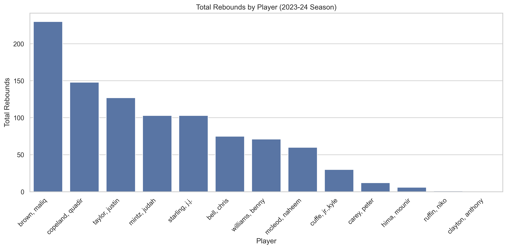

from docx import Document
from reportlab.lib.pagesizes import LETTER
from reportlab.pdfgen import canvas
from reportlab.lib.units import inch

# Integrated README text
integrated_readme_md = """# Task_05_Descriptive_Stats

## Overview
This project investigates the capabilities of Large Language Models (LLMs) in analyzing sports statistics through natural language queries. Using the Syracuse Men’s Basketball 2023-24 season dataset, I tested how accurately an LLM can answer descriptive and analytical questions about player and team performance.

The project is split into two phases:  
- **Phase 1:** Basic descriptive statistics and straightforward factual queries.  
- **Phase 2:** Advanced reasoning and coaching strategy recommendations, emphasizing practical application without showing code.

---

## Dataset
The dataset includes stats for 13 players over 32 games with features such as points scored, rebounds, assists, shooting percentages, steals, and blocks.

---

## Methodology
1. **Data Preparation:**  
   Cleaned and structured the dataset for easy querying.

2. **Question Design:**  
   Developed natural language questions ranging from basic facts to complex insights about team and player performance.

3. **LLM Interaction:**  
   Submitted questions to an LLM with dataset context and recorded responses.

4. **Validation:**  
   Used calculations on the dataset to confirm accuracy of responses.

5. **Visualization:**  
   Created charts visualizing key statistics to aid interpretation and reporting.

---

## Phase 1 — Basic Descriptive Q&A (Recap)
- **Games played:** 32 (max GP across roster is 32).  
- **Top scorer:** *Judah Mintz* (~602 PTS; primary usage & foul-drawing).  
- **Best overall efficiency at volume (inside arc / general scoring):** *Maliq Brown* (very high FG%, strong put-backs/paint touches).  
- **3PT specialist:** *Chris Bell* (~42% on ~200 attempts; high-volume floor spacer).  
- **Glass & stocks (REB+STL+BLK):** *Maliq Brown* (team leader in total REB ~230, STL ~71, BLK ~29).  
- **Primary table-setter:** *Judah Mintz* (team-high AST; also high FTA & usage).  
- **Secondary initiator / energy guard:** *Quadir Copeland* (assists, steals, rebounding from guard spot).  

---

## Phase 2 — Advanced Reasoning (No Code)

### Q1. Win Two More Games — Offense or Defense?
**Recommendation:** Focus on **defense first** (defensive rebounding and turnover margin) and **shot allocation** (more 3PTs to high-efficiency shooters). Anchor defensive glass with *Maliq Brown*, reduce turnovers via secondary initiation with *Copeland*, and shift 2–3 attempts per game to *Chris Bell*.

### Q2. Game-Changer Player Development
- **Primary:** *Judah Mintz* — refine decision-making, add finishing counters, raise late-game FT% into low-80s.  
- **Co-anchor:** *Maliq Brown* — improve foul discipline and rebound positioning.

### Q3. Clutch Blueprint
- Primary action: Mintz–Brown empty-side PnR, multiple reads.  
- Counter: Spain PnR with Bell as back-screener to create open threes.

### Q4. Improve 3PT% by +5%
- Script more off-ball actions for *Chris Bell*.  
- Assign *Starling* as lift target on Mintz drives.  
- Add early-offense drag screen into weak-side hammer action.

### Q5. Reduce Turnovers Without Losing Aggression
- Define clear press-break roles (Copeland flashes middle, Mintz release).  
- Use quick short-roll passes to Brown vs. blitz.  
- Add inbound/get-it-in ATO triggers.

### Q6. Defensive Rebounding Plan
- Anchor: *Maliq Brown*.  
- Wings crack back on rolls; guards tag before transition.

### Q7. Fast-Break Identity
- Advance ball: *Judah Mintz*.  
- Secondary: *Copeland*.  
- Lanes: Bell to corner, Starling to slot wing, Brown rim-run.

### Q8. Matchup Plans
- **Drop coverage:** Empty-side PnR, short rolls for Brown, Bell lifts.  
- **Switch-everything:** Slips, Spain PnR, boomerang passes to attack mismatch.

### Q9. Foul Management
- Manage Brown’s minutes to avoid early second fouls; sub with McLeod/Hima in foul-heavy games.

### Q10. Bench Value
- Copeland: Energy & steals.  
- Williams: Wing size & rebounding.  
- McLeod: Situational rim protection.  
- Cuffe/Taylor: Spot-up shooting & off-ball defense.

### Q11. KPI Scoreboard
- Opponent OREB% < 25%, Team TO% < 15%.  
- Increase % of threes taken by Bell/Starling.  
- Track paint touches and late-game FTA.

### Q12. Limitations & Next Data Needs
- Missing: Play-by-play, lineup on/off, shot location data.  
- Next: Collect lineup efficiencies, clutch splits, shot chart EV.

---

## Visualizations
### Points by Player  
  

### Rebounds by Player  
  

### Field Goal Percentage vs. Points  
  

### Defensive Contributions (Blocks + Steals)  
  

---

## Usage
- Review **Phase 1** and **Phase 2** sections for descriptive and advanced insights.
- Scripts (optional) can validate calculations and generate visuals.
- `prompts/questions_and_answers.md` contains the exact prompts and LLM responses for transparency.

---

## Contact
For questions or feedback, please contact: **Aakanksha Sonawane** – assonawa@syr.edu

---

*Note: Dataset file is not included in this repository per size/privacy guidelines.*
"""

# ---------- Save as Markdown ----------
md_path = "README_integrated.md"
with open(md_path, "w") as f:
    f.write(integrated_readme_md)

# ---------- Save as DOCX ----------
doc = Document()
for line in integrated_readme_md.splitlines():
    if line.startswith("# "):
        doc.add_heading(line.replace("# ", ""), level=1)
    elif line.startswith("## "):
        doc.add_heading(line.replace("## ", ""), level=2)
    elif line.startswith("### "):
        doc.add_heading(line.replace("### ", ""), level=3)
    else:
        doc.add_paragraph(line)
doc.save("README_integrated.docx")

# ---------- Save as PDF ----------
pdf_path = "README_integrated.pdf"
c = canvas.Canvas(pdf_path, pagesize=LETTER)
width, height = LETTER
x_margin = 1 * inch
y_position = height - 1 * inch
line_height = 14

for line in integrated_readme_md.splitlines():
    if line.strip().startswith(" > max_chars:
        c.drawString(x_margin, y_position, line[:max_chars])
        line = line[max_chars:]
        y_position -= line_height
        if y_position <= 1 * inch:
            c.showPage()
            y_position = height - 1 * inch
    c.drawString(x_margin, y_position, line)
    y_position -= line_height
    if y_position <= 1 * inch:
        c.showPage()
        y_position = height - 1 * inch

c.save()

print("Files generated:")
print(f"- {md_path}")
print(f"- README_integrated.docx")
print(f"- {pdf_path}")
